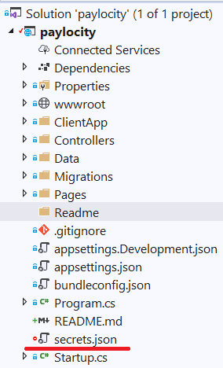
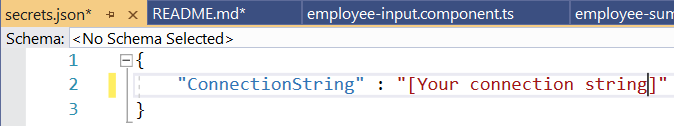
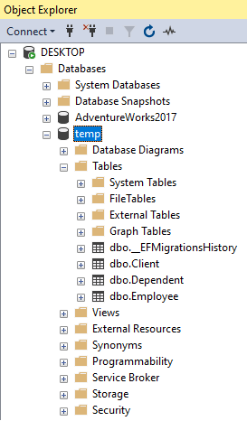
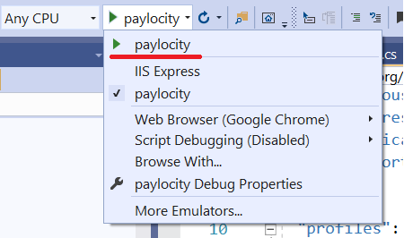

# Paylocity Coding Challenge
Thanks for checking out my submission for Paylocity's coding challenge!

## Getting Started
This project uses Entity Framework Core with SQL Server.

### secrets.json

In order to protect sensitive data I created a secrets.json file in the root of the project:



I wanted a simple project setup while acknowledging the importance of proper key management.
I opted for a secrets file and adding it to .gitignore.

secrets.json only needs a ConnectionString inside a JSON object:



Better ways to protect sensitive config settings include:
* Secret Manager
* Azure Key Vault / AWS KMS
* Config file encryption


### Database Creation
I used Entity Framework migrations for the database.

To create the database run the following command in terminal from inside the project folder:

```
dotnet ef database update
```

You should now see the temp database in SQL Server:



### npm install
Angular is run from node. Please install node if you haven't already.

In a terminal navigate to the client folder (./paylocity/ClientApp) and install the node packages:

```
npm install
```

### Starting the Site

The website is setup to serve ASP.NET CORE through Kestrel and Angular through node using Angular CLI.

In the Debug Target drop down select the "paylocity" option:



Happy browsing!

## Improvements
Some of the technology used in this coding challege is still pretty new to me and I was kind of learning on the fly. I cringe thinking about the implementation details. This section is a list of improvements I would've made if I had more time.

### Front End
* JWT
  * To create a new account, one only need submit a new name. No checking is done on the front or backend to ensure the user is who they say they are.
  * If I had more time I would've implemented a JWT and verified the users on the back end.
* More asynchronous functionality
  * lfgj
* Loading animations
  * When data is being pulled from the backend the screen is blank. I would've added more loading animations.
* Unit testing
  * I haven't learned front end unit testing for Angular yet.
* Proper component seperation
  * Employee Input and Employee Summary are far too large and need to be broken down into smaller components.
* More modules
  * Currently, every component is registered from the app.module. I would've created a couple more modules and included routing in each.
* Responsive formatting
  * I used flex for a lot of different components but did not have the time to ensure they're formatted correctly for smaller devices.
* Pagination of employee input and pagination from the server
  * When creating employees, I display all the data at once. In hindsight it might've been better to allow a search for employees and modifying on an individual screen.
  * When displaying all employees in a summary, all data is loaded at once. I would've liked to create some stored procedures to calculate stats and paginate the results with individual requests from the server.
* Bulk updates
  * Data on the front end could've been sent in sets instead of everytime an update was made by the user. This causes too many requests to be sent.
* Error page and better error handling
  * I didn't include an error page and error handling is minimal

### Back End
* Security
  * As noted in the previous JWT section, there's no authentication or authorization checks on individual requests to the server.
* Multi-tiered application
  * There should be a:
    * SPA: front end
    * Service Layer: controllers to handle requests
    * Business Layer: to implement business logic
    * Data Layer: for database interactions and contact to other services
    * Onion Architecture
    * Models specific to each layer of this application
    * Cross cutting concerns like logging
* Unit tests
  * I've done ungodly amounts of dependency injection, applying interfaces to classes and  unit testing. I just ran out of time before I could create some unit tests for this challenge.
* RESTful APIs
  * [Richardson Maturity Model level 3](https://www.martinfowler.com/articles/richardsonMaturityModel.html)
    * I've implemented the HAL Hypermedia standard in the past
  * API Documentation
    * I would've used Swagger as it seems to be the most popular standard
    * I've used RAML previously
* Logging
  * Logging to a file (or service) is essential for debugging problems.
  * A Global Exception Filer
* async everything
  * Controllers and Repositories should be returning Tasks
  * Using async free's up threads to work on other tasks instead of idling

### Database
* Stored procedures
  * There's a lot of code written in EF. I would've preferred to create a few sprocs to handle the more complex requests and updates.
* Non-Clustered index on the Client Name
  * When creating a client or logging a table search is done in EF. I would've added a non-collated index on the client name for faster search.
* History tables
  * Permanently deleting data is bad form. At the very least I would've liked to create triggers to store deleted Employees and Dependents in EmployeeHistory and DependentHistory tables.
